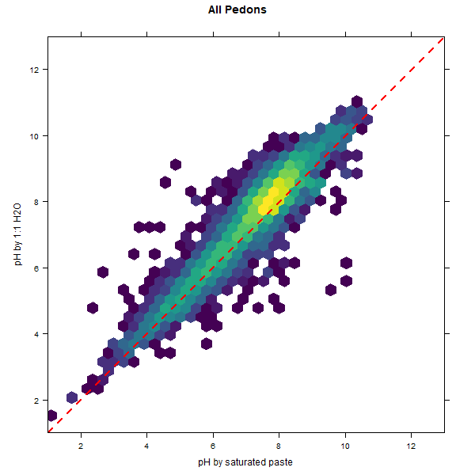

# Generate a KSSL pedon database for SoilWeb from the USDA-NRCS-NCSS snapshot

I periodically "process" the NCSS-KSSL characterization data snapshot (usually quarterly) into a consolidated chunk of data that are used within [SoilWeb](casoilresource.lawr.ucdavis.edu/sde/?series=auburn) and by [`fetchKSSL()`](http://ncss-tech.github.io/AQP/soilDB/KSSL-demo.html). This snapshot is typically delivered as an Access database and contains a mixture of: the latest "lab" data from LIMS, and the latest taxonomic and spatial data from NASIS. The resulting "processed" data include over 50 attributes, split into chunks that roughly approximate the "site/pedon" and "horizon" objects.

Snapshots:
 * KSSL lab, taxonomic, and location data: 2018-09-25 [QC results](https://github.com/dylanbeaudette/process-kssl-snapshot/tree/master/QC)
 * NASIS morphologic data: 2018-04-15

## News
* 2018-09-26: new KSSL snapshot from September 2018
* 2018-04-26: now more `wrd_l2` values, thanks to Jacob Isleib, closes [issue #4](https://github.com/dylanbeaudette/process-kssl-snapshot/issues/4)
* 2017-09-13: new KSSL / NASIS snapshot from September 2017 (64153 pedons, 413385 horizons)
* 2017-09-11: complete overhaul, now based on [FGDB -> TXT -> SQLite workflow](https://github.com/ncss-tech/lab-data-delivery/)
* 2017-04-24: fixed 2 major bugs: 1) data were shifted to the right by one column after "frags", 2) smarter estimated OC calculation
* 2016-11-17: added VG parameters estimated by [Rosetta](https://www.ars.usda.gov/pacific-west-area/riverside-ca/us-salinity-laboratory/docs/)
* 2016-09-06: new KSSL snapshot from 2016-09-06 (63571 pedons, 408290 horizons)
* 2016-04-22: added new code + web-service for basic NASIS morphologic data; data returned as JSON
* 2016-01-15: added a new column with fragments (percent by weight) > 2mm. **use these values with caution**
* 2015-12-18: started processing new snapshot "December 2015" (62922 pedons, 401427 horizons) **RaCA sites no longer included**
* 2015-12-11: loaded snapshot "August 2015" (64071 pedons, 402199 horizons)

## Data Cleaning
As part of the "processing" of these data, a number of data cleaning operations are performed.

### Taxonname
A new field caled `taxonname` is added. This field is set to the `correlated_as` value when not null and not "unnamed". Otherwise, the `taxonname` field is set to the value in `sampled_as`. 

### Horizonation
1. Missing lower horizon depths are replaced with the corrosponding top depth + 1cm.
2. "O" horizons using the old-style notation, with top depths > bottom depths, are removed. Sorry.

### MLRA and State Data
State and MLRA codes are added to the data using spatial overlay with the most recent US states and NRCS MLRA maps.

### Estimated Properties
1. K saturation is computed via `ex_k / base_sum`
2. total C and N values of 0 are replaced by NA
3. organic C estimated via `with(h, ifelse(is.na(oc), c_tot - (ifelse(is.na(caco3), 0, caco3) * 0.12), oc))`
4. organic matter estimated via `estimated_oc * 1.724`
5. C:N estimated via `h$estimated_oc / h$n_tot`
6. pH (1:1 H2O) estimated when missing via saturated paste pH (pedotransfer function)

7. base saturation (pH 8.2) calculated when missing: 
 + `h$bs82.computed <- with(h, (ex_ca + ex_mg + ex_na + ex_k) / (ex_ca + ex_mg + ex_na + ex_k + acid_tea)) * 100`

## Data Elements
Horizon Attributes:

  * pedon_key (internal ID)
  * labsampnum (links KSSL and NASIS records)
  * hzn_top (horizon top depth: cm)
  * hzn_bot (horizon bottom depth: cm)
  * hzn_desgn (horizon designation, updated)
  * hzn_desgn_old (original horizon designation)
  * lab_texture_class (lab determined texture class)
  * sand (sand, wt. %)
  * silt (silt, wt. %)
  * clay (clay, wt. %)
  * co3_cly (carbonate clay ??)
  * silt_f_psa (fine silt, wt. %)
  * silt_c_psa (coarse silt, wt. %)
  * vfs (very fine sand, wt. %)
  * fs (fine sand, wt. %)
  * ms (medium sand, wt. %)
  * cs (coarse sand, wt. %)
  * vcs (very coarse sand, wt. %)
  * acid_tea
  * base_sum
  * al_kcl: KCl extractable aluminum approximates the exchangeable Al, and is a measure of the active acidity present in soils with a 1:1 water pH less than 5.5. It relates to the immediate lime requirement and the CEC of the soil. cmol(+)/kg
  * cec7 (CEC measured at pH 7, ... details)
  * cec82 (CEC measured at pH 8.2, ... details)
  * ecec: cmol(+)/kg
  * al_sat: Aluminum saturation is calculated by (AL_KCL/(Sum of bases))*100. It provides some inference of potential Al toxicity problems, although many other factors influence Al toxicity, %
  * bs82 (base saturation, pH 8.2, ... details)
  * bs7 (base saturation, pH 7, ... details)
  * ex_ca
  * ex_mg
  * ex_na
  * ex_k
  * ph_h2o
  * ph_cacl2
  * ph_kcl
  * ph_sp
  * ph_ox (pH, Oxidized)
  * gypl20
  * caco3
  * ec_12pre
  * sar
  * oc (organic C, weight percent)
  * c_tot
  * n_tot
  * fe_dith (weight percent, <2mm fraction)
  * fe_ox (weight percent, <2mm fraction)
  * al_dith (weight percent, <2mm fraction)
  * al_ox (weight percent, <2mm fraction) 
  * p_olsn
  * p_nz
  * db_13b
  * db_od
  * COLEws
  * whc
  * w3cld
  * w15l2
  * w15cly
  * cec7_cly
  * frags (weight percentage > 2mm)
  * wrd_l2 (Water Retention Difference, 1/3 to 15 Bar, <2mm: usually calculated from other properties)
  * estimated_oc
  * estimated_om
  * estimated_c_to_n
  * ex_k_saturation
  * estimated_ph_h2o
  * theta_r
  * theta_s
  * alpha
  * npar
  * Ks
  * Ko
  * Lpar

Site/Pedon Attributes:

  * pedon_key
  * pedlabsampnum
  * pedon_id
  * x
  * y
  * sampled_as
  * correlated_as
  * correlated_taxon_kind
  * pscs_top
  * pscs_bottom
  * pedon_completeness_index
  * ssl_taxsubgroup
  * taxonname
  * state
  * mlra

Morphologic (field-described) Attributes:

  * horizon colors (phcolor table)
  * rock fragments -- volume percent (phfrags table)
  * pores (phpores table)
  * structure (phstructure)
  * NASIS pedon/site/siteobs distillation
  * NASIS taxonomic history disillation

